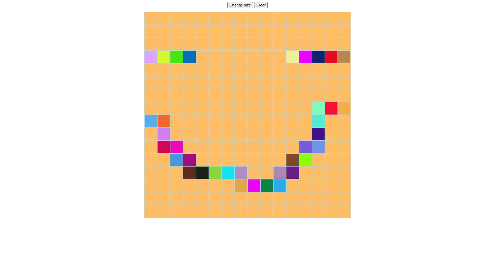

# 🎮 Etch A Sketch

This is the fourth project from [The Odin Project](https://github.com/TheOdinProject) curriculum — a Etch A Sketch game mostly built in Javascript to practice core programming skills.

## ✨ Preview

## 🛠️ Skills Learned

### 📜 JavaScript Basics

- Variables and Operators
- Data Types and Conditionals
- JavaScript Developer Tools
- Function Basics
- Understanding Errors
- DOM Manipulation and Events
